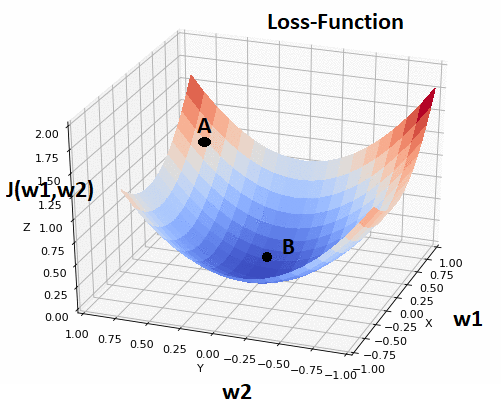
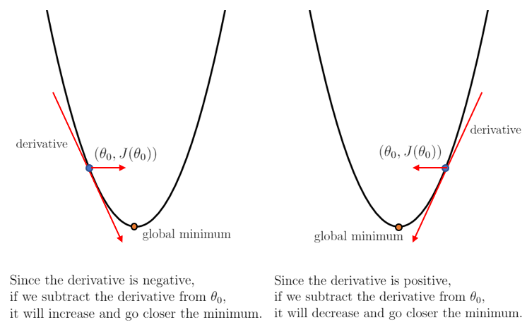
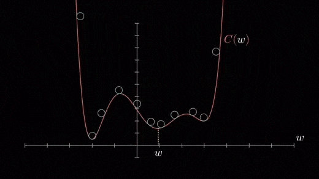
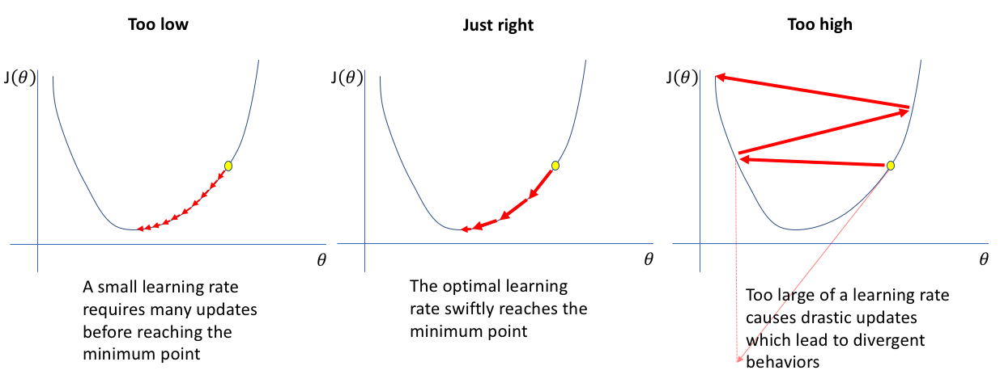

# Gradient Descent 
Gradient Descent is <b>decent</b> at estimating parameters.  
which underlies how ML models or neural networks learn by training their parameters

In statistics, Machine Learning and other Data Science fields, we optimize a lot of stuff.   
When we fit a line with linear regression, we optimize the intercept and slope.  
when we use logistics regression, we optimize a squiggle (a short line that curls and loops in an irregular way).  
And When we use t-SNE, we optimize clusters etc....  

<b>Gradient descent can optimize all these things and much more.</b>

Gradient descent is a first-order iterative optimization algorithm for finding a <b>local minimum of a differentiable function</b>. The idea is to take repeated steps in the opposite direction of the gradient (or approximate gradient) of the function at the current point, because this is the direction of <b>steepest descent</b>. It reaches the local minima by taking big steps when it is far away and baby steps when it is close. Conversely, stepping in the direction of the gradient will lead to a local maximum of that function; the procedure is then known as gradient ascent.

In our usecases, we try to minimise the loss function $L$ where the weights $w$ are the deciding paramaters. Minima of Loss-function intuitively means, finding the weights at the bottom-most point of the contour of a loss-function,where the Loss-function has its minimum value.  
 
In the above figure, loss function is $J$ and $ w = [w_1,w_2] $. We initialize weights randomly at point A,the weights at point A will give very high loss-value which in turn makes our model to perform very badly. From point A, we need to navigate to the point B where the Loss is minimum and find the values of weights at point B,which are our required optimal weights.    
Calculus gives a really easy solution to find the local minima of a function J by making its derivative $\frac{d}{dw}J(w) = 0 $  
But that's not always feasible for really complicated functions. A more flexible tactic is to   

<b><i>"start at any point any figure out which direction you should step to make that output lower"</i></b>

This above statement has two important things inside it 
- Direction
- Step size

### Let's talk about direction

we will have infinite number of directions to move in space from that point A. But our goal is to find <i>"WHAT IS THE DOWNHILL DIRECTION ?"</i> 
<b>Graphical approach :- </b> 
If you can figure out the slope of the function at where you are, then shift to the left if that slope is positive and shift to the right if that slope is negative.
  
In the left plot, we can see our slope is negative and minima is located to the right of us => we need to move right to reach the minima.  
Similarly in the right plot, we can see our slope is positive and minima is located to the left of us => we need to move left to reach the minima.   
<b>Calculus approach :-</b> 
From multivariable calculus, we know that the gradient of a function gives the direction of steepest ascent.  
Note :- steepest ascent is the direction you should step to increase the function most quickly.  
Naturally enough, taking the negative of that gradient gives you the direction you should step to decrease the function most quickly which we can call as the direction of steepest descent. This is how the algorithm got it’s name as Gradient Descent.

There is a <b>problem in these approaches</b>. Our goal is to reach the global minima, but for suppose if our function has a lot of local minima's we might just end up in one of them rather than the global minima depending on the initial parameters with which we started.  
In this case, there's no gurantee that the local minima we're going to reach is our desired global minima.  
Mainly because Gradient descent is driven by the gradient, which will be zero at any minima.

### Let's talk about step size

The length of the gradient vector is actually an indication for just how steep the slope is ....  
So if we are making our step sizes proportional to slopes, then when the slope is flattening out towards the minimum, your steps get smaller and smaller and that kind of helps you from overshooting.
  
- Too low learning rate progresses very slowly and takes lot of time to converge.

Learning rate can affect the training time by an order of magnitude.  
<b>Choosing the best Learning-rate is very crucial in training a model, so How do we choose the best learning-rate then ????</b>
1. Cross-Validation.
2. Hyper-parameter tuning using GridSearchCV.
3. Learning rate with decay after fixed number of iterations can be a very good hack( Decrease the learning rate as we approach minima) which is in technical terms called as Simulated annealing.

### Now that we got our direction and step-size, what should we do now?????
Once we got our direction and step-size, we will take a step along the direction opposite to that of direction of gradient at that point and recompute the gradient at whatever position we end up at, we will repeat this process till we reach our required minima.

### How do we know whether we reached minima or not????
In real life, we might can never reach the minima , but we keep dodging in a flat-region in close vicinity of the minima, where the loss is almost minimum. Often we stop our iterations when the change in loss value hasn’t improved much in a pre-defined number like 10 or 15 iterations. When this happens, we can say our training has reached convergence.

## How do we update the weights after every iteration?
$$
    w_j = w_j - \eta * \frac{\partial L(w)}{\partial w_j}
$$
This update is simultaneously done for all the weights. And the substraction between weight vector and gradient vector in the formula is because we have to move in a direction which can make us reach the optimal weight vector.

Gradient descent is a First Order Optimization method as it only takes first order derivatives of the loss function.

### ALGORITHM
- <b>Step 1</b> :- Take the derivative of the loss function for each parameter in it.
- <b>Step 2</b> :- Pick random values for the parameters.
- <b>Step 3</b> :- Calculate step sizes (step size = slope * learning rate)
- <b>Step 4</b> :- Calculate the new parameters : new parameter = old parameter - step size
- <b>Step 5</b> :- Go and repeat from step 3 unless the step size is very small, or you reach the maximum number of steps

### Variations
if the size of data is small, the calculations are less and won't take much time. But in real world when you have millions of datapoints, it can take a pretty long time. So, there is a variation called <b>Stochastic Gradient Descent</b> that uses a randomly selected subset of the data at every step rather than the full dataset. This reduces the time spent calculating the derivatives of the loss function.
